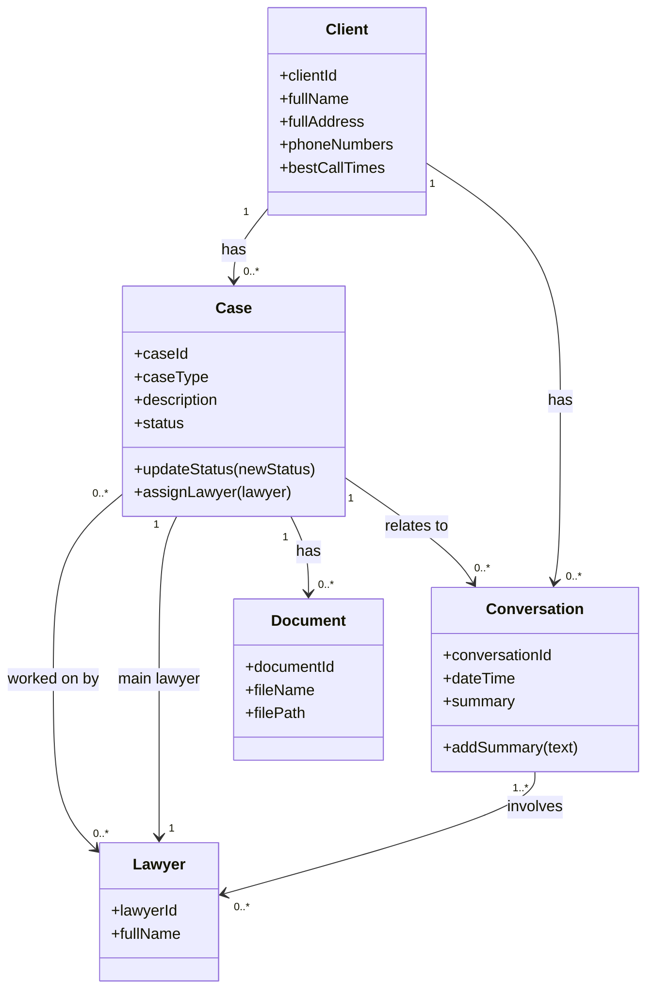
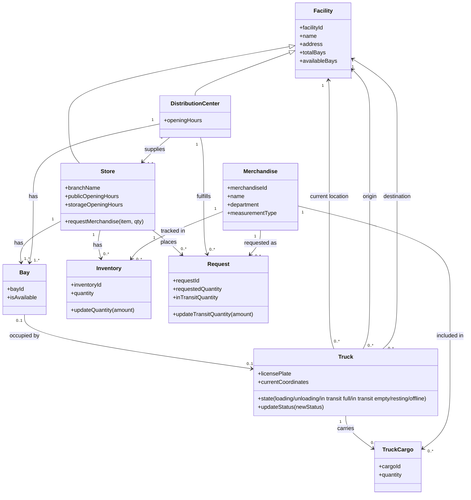

# Assignment 9

## How to generate the image
1. Open the Mermaid Live Editor.
2. Copy the Mermaid code below.
3. Paste it into the editor.
4. The diagram will appear automatically.
5. Export it as PNG or SVG.

```
https://mermaid.ai/open-source/syntax/classDiagram.html
```

### Law Firm



### Supermarket

